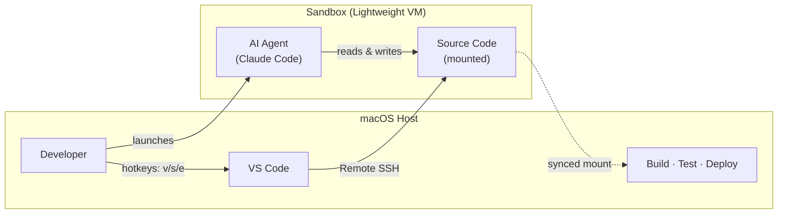

# srl-sandbox

Sandboxed dev environments on macOS using [Apple Container](https://github.com/apple/container). Isolated Linux containers for safe coding with LLM agents like Claude Code.



> **Design principle:** The sandbox is for **agent-driven development only** — AI agents read/write code in an isolated environment. Building, testing, deployment, and hosting remain on the host machine or CI/CD.

## Requirements

- macOS 26+ (Tahoe) with Apple Silicon
- [Apple Container CLI](https://github.com/apple/container): `brew install container`

## Install

```bash
brew tap DCPMA/srl-sandbox https://github.com/DCPMA/srl-sandbox.git
brew install srl-sandbox
```

Or manually:

```bash
git clone https://github.com/DCPMA/srl-sandbox.git && cd srl-sandbox && ./install.sh
```

## Quick Start

```bash
cd ~/Projects/myapp && srl-sandbox   # launch sandbox (image auto-builds on first run)
```

While running, use these hotkeys:

| Key          | Action                     |
| ------------ | -------------------------- |
| `v`          | Open VS Code Remote SSH    |
| `s`          | SSH into the sandbox       |
| `e`          | Sync extensions & settings |
| `q` / Ctrl+C | Stop the sandbox           |

Use `-d` to launch detached (headless).

> **Tip:** Press `Tab` to auto-complete sandbox names in all commands.

## Commands

| Command                              | Description                                          |
| ------------------------------------ | ---------------------------------------------------- |
| `srl-sandbox [path]`                 | Launch/resume sandbox for a project                  |
| `srl-sandbox [path] -d`              | Launch detached (headless)                           |
| `srl-sandbox stop <name or all>`     | Stop sandbox(es)                                     |
| `srl-sandbox destroy <name or all>`  | Remove sandbox(es)                                   |
| `srl-sandbox list`                   | List all sandboxes                                   |
| `srl-sandbox info <name>`            | Show sandbox details                                 |
| `srl-sandbox ssh <name>`             | SSH into a sandbox                                   |
| `srl-sandbox sync-extensions <name>` | Sync VS Code extensions & settings from host         |
| `srl-sandbox build`                  | Build/rebuild the container image                    |
| `srl-sandbox reset [--all]`          | Remove base image (--all destroys all sandboxes too) |
| `srl-sandbox sync <name>`            | Sync dotfiles into a sandbox                         |
| `srl-sandbox version`                | Show version                                         |

## Mounts

| Host              | Container                    |
| ----------------- | ---------------------------- |
| Project directory | `/home/dev/<dirname>`        |
| `~/.ssh`          | `/home/dev/.ssh` (read-only) |
| `~/.aws`          | `/home/dev/.aws` (via mount) |
| `~/.gitconfig`    | `/home/dev/.gitconfig`       |

## License

MIT
